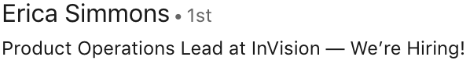
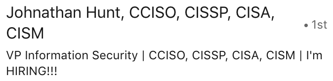
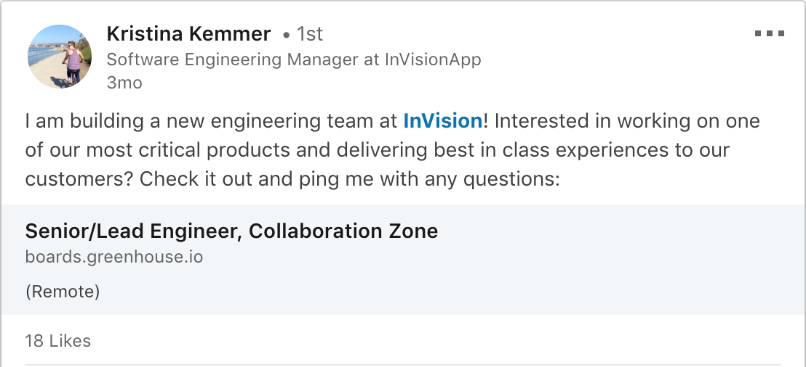
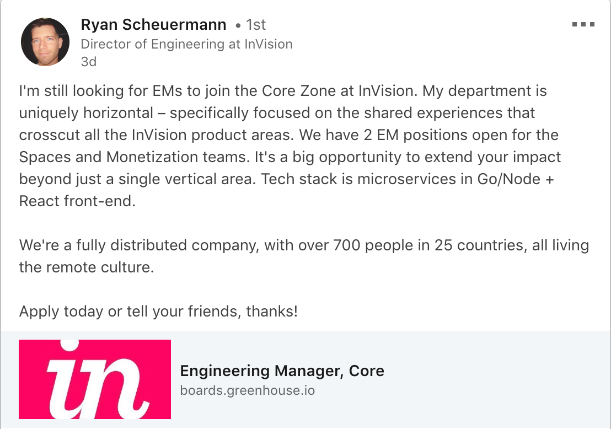
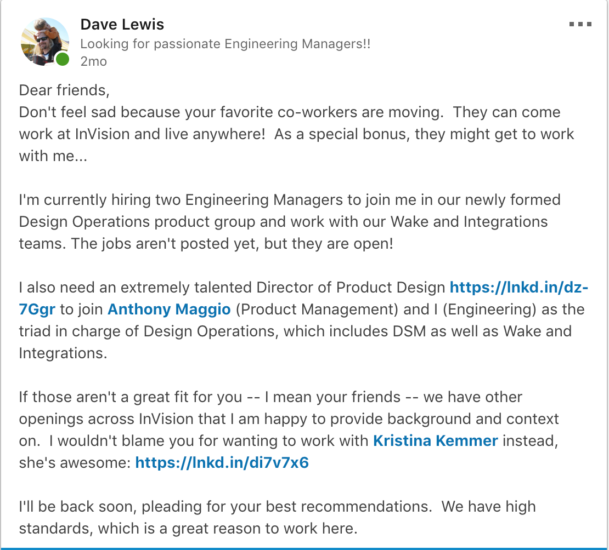
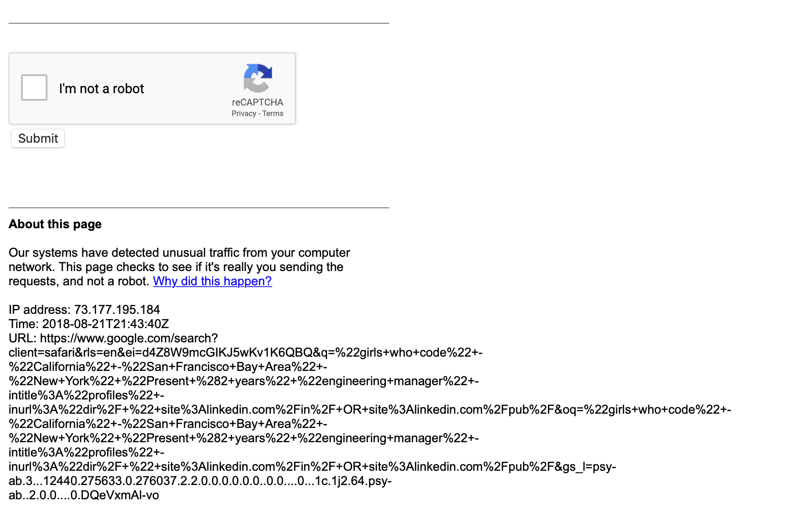
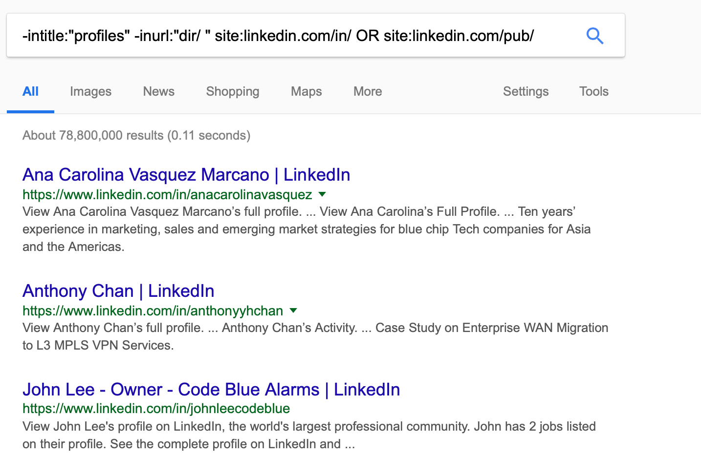
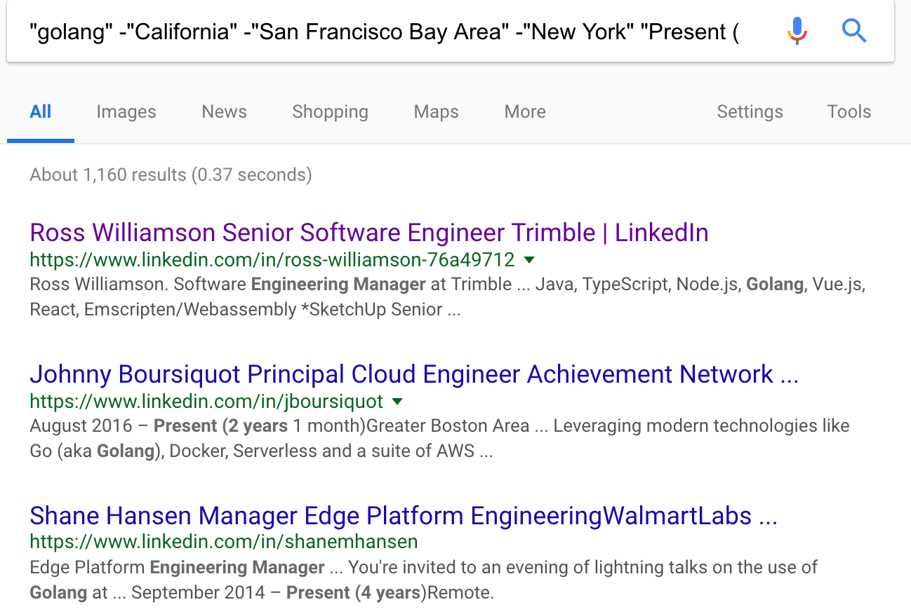
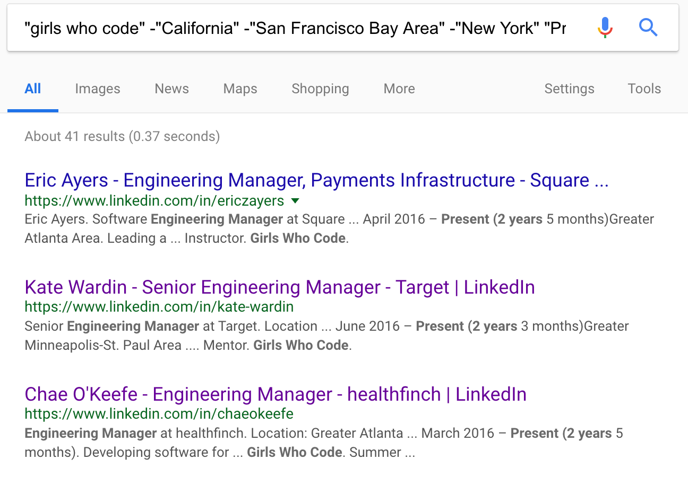

# LinkedIn Spelunking for the Modern Manager
If you find yourself needing your own pipeline for candidates, LinkedIn is an obvious place to start. Here are some techniques that you may find useful (they start very obvious).  Some of them are guidelines I learned the hard way (that maybe should have been obvious).

----------

1. Your own network.
    1. Make sure your LinkedIn profile is up to date.
    2. Update your network.
    3. Update your headline.
    4. Post a compelling note in your feed.
    5. Make direct contact with your list from before.
    6. Be a social animal.
2. Ok, now what?
3. Friend of a Friend.
4. Perfect Strangers.
    1. First: Find Potential Candidates.
    2. Second: Become One Of Those People.
    3. Third: Get In Touch.
    4. Fourth: They Really Like Me!
----------

# Your own network.

The very best place to start.

----------

## Make sure your LinkedIn profile is up to date.

Everyone you reach is going to come to your profile.  Make it current and make it appealing.  You're going to reference what you're working on as you recruit, so make sure that's reflected in your profile as well.

----------

## Update your network.

Go through `People you may know` [https://www.linkedin.com/mynetwork/](https://www.linkedin.com/mynetwork/) and connect. 

Everyone has their own philosophy for how broadly they connect, but regardless there are almost certainly former co-workers, friends, and family who you haven't yet added.  You will be relying on this network to broadcast your messages and validate your appeal, so get this up to date first. 

Don't be afraid to go down the rabbit hole of connecting with one person and then realizing they have an entire cluster of additional people you want to add.
**Make a note of people you want to mail directly either to recruit personally or to specifically ask for an introduction.**

----------

## Update your headline.

Make it clear you are hiring, so that if you engage at all via LinkedIn, people will see it:

----------

## Post a compelling note in your feed.

This is easy to do and will give you a reference for the rest of your conversations.  Assuming you are looking for candidates who will report to you, make sure to display some of your personality and tone -- this is an opportunity to appeal to the reader beyond what is in a job posting.

**Examples:**

Your best advocates will `Like` or `Share` this posting with their own networks, giving you visibility to another layer of people. 

----------

## Make direct contact with your list from before.

Send individual mail to the people you noted from your network grooming, sending them the link to your posting.  You can and should be even more personal here.

----------

## Be a social animal.

Do a little more `Like` ing and commenting than you might normally -- this is a way to get yourself in front of everyone else's networks.  You don't need to be a troll, but this is a good opportunity to get back in touch with people you maybe haven't seen in awhile but could be the weak connection that knows just the right person for you.

----------

# Ok, now what?

If you have filled your reqs via the above steps, congratulations!  Those referrals are likely very high quality with a high chance for success.
If not, we move into the "cold call" phase.

----------

# Stage One: Friend of a Friend

You probably already know which of your connections:

- will enthusiastically approach people in their network for you
- are connected to lots of interesting people.

Start with their profiles and dig through their networks.  Make a list of the people you like and ask for backgrounds or introductions.  You will get solid initial insight into the people you are looking at and at least a mildly warm introduction. 🙂 

----------

# Stage Two: Perfect Strangers

Darn it, you still haven't found the people you need.  Time to pound the pavement.

## First: Find potential candidates.

Unfortunately, LinkedIn's native search is extremely limited.  Fortunately, Google steps into the breach.

> NOTE: Do this in a browser that is logged in to Google.  Otherwise you will likely trigger their robot detection, and going through the captchas is really tedious.  If you are logged in, you can just check the "I am not a robot" box and it will believe you 🙂 

Using the in-site (X-Ray) search, you can limit your search to LinkedIn profiles:

    -intitle:"profiles" -inurl:"dir/ " site:linkedin.com/in/ OR site:linkedin.com/pub/

Now you can start to add useful filters.  One obvious one might be "engineering manager"

    "engineering manager" -intitle:"profiles" -inurl:"dir/ " site:linkedin.com/in/ OR site:linkedin.com/pub/

However we're still at parity with the native search.
For example, I like to look for people who have been in their current position for at least 2 years.  You can't do this in LinkedIn, but we can here:

    "Present (2 years" "engineering manager" -intitle:"profiles" -inurl:"dir/ " site:linkedin.com/in/ OR site:linkedin.com/pub/

That will only match 2 years, but you can iterate up to 3, 4, 5, etc.
I also wanted to filter out the big tech companies, so I used location as a proxy:

    -"California" -"San Francisco Bay Area" -"New York" "Present (2 years" "engineering manager" -intitle:"profiles" -inurl:"dir/ " site:linkedin.com/in/ OR site:linkedin.com/pub/

And of course if there are nice-to-haves, you can include them:

    "golang" -"California" -"San Francisco Bay Area" -"New York" "Present (2 years" "engineering manager" -intitle:"profiles" -inurl:"dir/ " site:linkedin.com/in/ OR site:linkedin.com/pub/

or target Girls Who Code supporters:

    "girls who code" -"California" -"San Francisco Bay Area" -"New York" "Present (2 years" "engineering manager" -intitle:"profiles" -inurl:"dir/ " site:linkedin.com/in/ OR site:linkedin.com/pub/

## Second: Become one of those people.

Each time you open a new profile, look at `People Also Viewed` on the right.  Keep opening new tabs with interesting titles or companies.  It might be that *other* EM at Trimble who is a great fit, and LinkedIn does you the solid of making them only a click away.  You want a wide net, and this is a great way to enlarge it.

## Third: Get in touch.

It turns out just opening a profile on LinkedIn is rarely enough to magically bring in a candidate...you're going to have to say "Hi".  You should wordsmith a framework you will re-use, but **you need to customize each message if you expect a response**.  The person you are contacting is just like you and can smell a form letter a mile away.  Your subject and first sentence must be specific and attention-getting.  That is what they will see in their inbox or notification.

> By the way, most people will ignore you.  Like 95%.  Sorry.  Even with a lovingly crafted message. 

A couple of examples (that got responses):

    Subject: I always want to talk to design operations engineers
    
    Hi *******,
    
    I have a pretty standard guideline not to recruit people who just started a new role, and I see that you just started managing a team a few months ago. I hope you are enjoying it!
    
    I'm a Director of Engineering at InVision, and I work with the Design Operations group, which means we build products for managing design systems and other design challenges at scale. I have been looking for a couple of Engineering Managers, though we are also hiring for some design and engineering positions as well. I can't speak to which role might appeal most to you, but given your background I at least wanted to introduce myself. I would love the opportunity to chat, either asynchronously here or via video, or you can just keep us in mind when you're ready for a new environment or new hometown (we're entirely remote).
    
    I hope to hear from you soon. Thanks!
    Dave
----------

    Subject: when you're ready for something new, let's talk about InVision
    
    Hi *******,
    
    I'm a Director of Engineering at InVision, and I work with the Design Operations group, which means we build products for managing design systems and other design challenges at scale. I am really intrigued to hear how your background as a teacher fits into your current role as an Engineering Manager. We are hiring for a couple of Engineering Managers in the Design Operations group, and I would love the opportunity to chat about them, either asynchronously here or via video. I hope to hear from you soon. Thanks!
    
    Dave

This didn't 😞 

    Subject: when you're ready for something new, let's talk about InVision
    
    Hi *****,
    This is a cold call :) I'm a Director of Engineering at InVision, and I'm looking for Engineering Managers with strong backgrounds to work with us. If building the future of design at scale, working with keen, collaborative peers, or the ability to work anywhere in the world raises your eyebrows, I would love the opportunity to chat, either asynchronously here or via video. I hope to hear from you soon. Thanks!
    Dave

## Fourth: They really like me!

Someone wrote back!

- They might just be considerately declining your interest -- but this is still someone you might talk to down the road, so make sure to promptly respond in kind, and leave the door open.
- If they are interested, set up a time to talk!  This is essentially the Recruiter Screen and Hiring Manager Screen rolled into one.  Set aside about 30-45 minutes to explain who you are, why you are interested in them, and what the position is.  You will also be able to get some more detail on who they are, their work history, and what they are looking for.
    - Your goal is to know by the end of the conversation if you want to bring them into the interview loop or not.  If you run out of time, that's ok -- you might have a brief 15 minute intro conversation and then follow up with 30 minutes that's more screen-focussed, if there's still interest on both sides.
- If there's a match, get them into your talent tracking tool (Greenhouse, etc) and set up that Interview loop!  Don't leave them hanging now that you have their attention.
- Because you are now their point of contact, you are responsible for "keeping them warm" between interviews: "Hey, here's what's coming up next!", "You'll be talking to A and B, it should be a great conversation.", "You'll be getting invites soon for the next couple of interviews that will focus on Y and Z."
- You'll need to let them down if there's not a fit.  Check with your People team to see if they have some great boilerplate you can borrw.